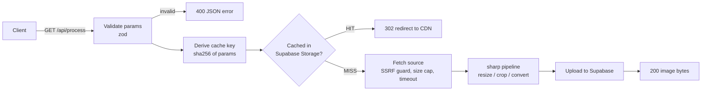

<p align="center">
  <picture>
    <source media="(prefers-color-scheme: dark)" srcset="public/logo-dark.png">
    
  </picture>
</p>

<h1 align="center">APIracy — Image Processing Service</h1>

<h3 align="center">
  <strong>Live:</strong> <a href="https://apiracy.vercel.app/">apiracy.vercel.app</a>
</h3>

<p align="center">
  <table>
    <tr>
      <td align="center"><a href="https://github.com/Akim-Delli/APIracy/actions/workflows/lint.yml"></a></td>
      <td align="center"><a href="https://github.com/Akim-Delli/APIracy/actions/workflows/test.yml"></a></td>
      <td align="center"><a href="https://github.com/Akim-Delli/APIracy/actions/workflows/build.yml"></a></td>
      <td align="center"><a href="https://github.com/Akim-Delli/APIracy/actions/workflows/deploy.yml"></a></td>
      <td align="center"><a href="https://github.com/Akim-Delli/APIracy/actions/workflows/coverage.yml"></a></td>
    </tr>
    <tr>
      <td align="center"></td>
      <td align="center"></td>
      <td align="center"></td>
      <td align="center"></td>
    </tr>
  </table>
</p>

A Cloudinary-style image processing API: pass a public image URL and transformation
parameters, get back a resized/converted image. Try it at **[apiracy.vercel.app](https://apiracy.vercel.app/)**.
Includes video thumbnail extraction, Supabase-backed CDN caching, an interactive
playground UI, full OpenAPI documentation and a Claude-backed assistant.

Built with **TypeScript / Next.js 16**, deployed on **Vercel** via **GitHub Actions**.

```
# Resize an image
GET /api/process?url=https://example.com/image.jpg&width=500&height=300

# Convert image format
GET /api/process?url=https://example.com/image.png&format=jpeg&quality=80

# Combine operations
GET /api/process?url=https://example.com/image.jpg&width=800&height=600&format=webp&crop=fill

# Video thumbnail (bonus)
GET /api/video/thumbnail?url=https://example.com/video.mp4&time=15
```

## What's included

| Surface | Path | Description |
|---|---|---|
| Image API | `GET /api/process` | Resize, crop, convert, re-quality any public image |
| Video API | `GET /api/video/thumbnail` | Extract a frame at a timestamp, with all image transforms applied |
| Health | `GET /api/health` | Liveness + cache configuration status |
| OpenAPI spec | `GET /api/openapi.json` | OpenAPI 3.1 document |
| API reference | `GET /docs` | Interactive docs (Scalar) with a built-in request runner |
| Playground UI | `GET /` | Visual playground: tweak parameters, preview results, copy curl snippets |
| Assistant | chat widget · `POST /api/chat` | Claude-backed "digital twin" that answers questions about the API |

No authentication — all endpoints are public by design.

## API overview

### `GET /api/process`

| Param | Type | Description |
|---|---|---|
| `url` | string, **required** | Public http(s) URL of the source image (≤ 20 MB). jpeg, png, webp, avif, gif, tiff, svg inputs supported. |
| `width` | int 1–4096 | Output width. One dimension alone preserves aspect ratio. |
| `height` | int 1–4096 | Output height. |
| `format` | `jpeg` `png` `webp` `avif` (`jpg` = alias) | Output format. Defaults to the source format (or `png` if the source can't be re-encoded, e.g. svg/gif). |
| `quality` | int 1–100 | Encoding quality for lossy formats; enables palette quantization for png. |
| `crop` | `fill` `fit` `scale` `crop` | How to fit into `width`×`height`. `fill` (default) covers the box and crops overflow; `fit` shrinks to fit inside; `scale` stretches; `crop` extracts a centered region without scaling. |

With only `url`, the image is re-served as-is (proxy mode).

### `GET /api/video/thumbnail`

Same transform params as above (output `format` defaults to `jpeg`), plus:

| Param | Type | Description |
|---|---|---|
| `url` | string, **required** | Public http(s) URL of the source video (≤ 50 MB, anything ffmpeg decodes). |
| `time` | seconds (`15`, `12.5`) or `mm:ss` / `hh:mm:ss` | Frame timestamp, default `0`. Past-the-end timestamps return a 422. |

### Responses

- **`200`** — the processed image bytes (`X-Cache: MISS` on first request, `BYPASS` if no cache configured). `X-Image-Width/Height/Format` headers describe the output.
- **`302`** — cache hit: redirect to the cached object on the Supabase CDN (`X-Cache: HIT`). Browsers and curl (`-L`) follow transparently.
- **Errors** — consistent JSON envelope, with per-parameter details for validation failures:

```json
{
  "error": {
    "code": "INVALID_PARAMS",
    "message": "Invalid query parameters",
    "details": [{ "param": "width", "message": "must be at least 1" }]
  }
}
```

| Status | Code | When |
|---|---|---|
| 400 | `INVALID_PARAMS` | Bad/missing query parameters |
| 400 | `FORBIDDEN_HOST` | Source host is private/internal (SSRF guard) |
| 415 | `UNSUPPORTED_MEDIA_TYPE` | Source fetched but not decodable as image/video |
| 422 | `SOURCE_FETCH_FAILED` | Source unreachable, non-2xx, too large or timed out |
| 422 | `PROCESSING_FAILED` | Decode/transform failed (e.g. frame time past end of video) |
| 429 | `RATE_LIMITED` | Too many requests from this client (see Rate limiting) |
| 500 | `INTERNAL_ERROR` | Unexpected failure |

### Rate limiting

The public endpoints carry a generous per-IP rate limit so an open, unauthenticated
service can't be trivially abused or run up compute/LLM costs. Over the limit returns
`429 RATE_LIMITED` with `Retry-After` and `RateLimit-*` headers. Defaults (tunable via
`RATE_LIMIT_*` env vars): `/api/process` 100/min, `/api/video/thumbnail` 30/min,
`/api/chat` 20/min. The limiter is in-memory (best-effort per serverless instance) — for a
strict global quota, back it with a shared store like Upstash Redis or Vercel KV.

## Architecture



- **Cache hits** redirect (302) to Supabase's CDN, so repeat traffic never touches the
  compute layer. **Cache misses** upload the result, then stream the bytes directly —
  no second round-trip on first request.
- **Cache keys** are a sha256 of the normalized parameter set, so equivalent requests
  (any query-string order) share one cached object.
- If Supabase isn't configured (or an upload fails) the API degrades gracefully and
  streams results directly (`X-Cache: BYPASS`) — local dev works with zero setup.
- The video endpoint downloads the source to `/tmp`, extracts one frame with a static
  `ffmpeg` binary, then reuses the exact same image pipeline and caching path.

### Project layout

```
app/
  page.tsx                    # playground UI
  docs/page.tsx               # Scalar API reference
  api/process/route.ts        # image endpoint
  api/video/thumbnail/route.ts
  api/health/route.ts
  api/openapi.json/route.ts
  api/chat/route.ts           # digital-twin assistant (Claude)
  _components/                # playground + chat widget UI
lib/
  schemas.ts                  # zod param validation (single source of truth)
  fetch-source.ts             # SSRF-guarded source download
  image-pipeline.ts           # sharp transforms
  video-thumbnail.ts          # ffmpeg frame extraction
  storage.ts                  # Supabase Storage cache
  rate-limit.ts               # per-IP rate limiter
  cache-key.ts / respond.ts / errors.ts / config.ts / openapi.ts / chat.ts / assistant-prompt.ts
tests/
  unit/                       # schemas, ssrf, cache keys, pipeline, rate limit, storage, ...
  integration/                # route handlers against a local fixture server
scripts/                      # setup-supabase.ts (bucket bootstrap), check-supabase.ts
.github/workflows/            # lint, test, build, coverage + deploy (Vercel)
```

## Getting started

### Run locally

```bash
npm install
npm run dev        # http://localhost:3000
```

That's it — without Supabase credentials the service runs in cache-bypass mode.
To test against images on your own machine/network, set `SSRF_ALLOW_PRIVATE=true`
(never in production).

```bash
curl -L "http://localhost:3000/api/process?url=https://upload.wikimedia.org/wikipedia/commons/3/3a/Cat03.jpg&width=400&format=webp" -o cat.webp
```

### Run with Docker (local)

A `Dockerfile` and `docker-compose.yml` are provided for running the service
locally — production is deployed to Vercel, so this is purely a convenience for
local use. The image is Debian-based so sharp (libvips) and the bundled ffmpeg
binary work without extra system packages.

```bash
docker compose up --build      # builds, then serves http://localhost:3000
```

Or with plain Docker:

```bash
docker build -t apiracy .
docker run --rm -p 3000:3000 apiracy
```

With no configuration the container runs in **cache-bypass** mode (results are
streamed directly, `X-Cache: BYPASS`). To enable the Supabase cache, create a
`.env` (see `.env.example`) — `docker compose` picks it up automatically:

```env
SUPABASE_URL=https://<project-ref>.supabase.co
SUPABASE_SERVICE_ROLE_KEY=<service-role-key>
# SSRF_ALLOW_PRIVATE=true   # only if you need to fetch from localhost/private hosts
```

### Run tests

```bash
npm test                # 139 tests: unit + route integration (incl. real ffmpeg)
npm run test:coverage   # 91% line coverage on lib/ (see badges/coverage.svg)
npm run lint
npm run typecheck
```

Integration tests spin up a local HTTP fixture server and exercise the real route
handlers — including synthesizing a test video with ffmpeg and extracting frames
from it. No network or external services needed.

### Enable the Supabase cache

1. Create a project at [supabase.com](https://supabase.com) (free tier is fine).
2. From **Project Settings → API**, copy the project URL and the `service_role` key.
3. Create `.env` (see `.env.example`):
   ```
   SUPABASE_URL=https://<project-ref>.supabase.co
   SUPABASE_SERVICE_ROLE_KEY=<service-role-key>
   ```
4. Create the public cache bucket:
   ```bash
   npm run setup:supabase
   ```

### Deploy to Vercel (via GitHub Actions)

1. Create a Vercel project: `npx vercel link` (or import the repo in the Vercel
   dashboard with build disabled for pushes — GitHub Actions does the deploying).
2. In **Vercel → Project → Settings → Environment Variables**, add
   `SUPABASE_URL`, `SUPABASE_SERVICE_ROLE_KEY` (and optionally `SUPABASE_BUCKET`).
3. In **GitHub → Repo → Settings → Secrets and variables → Actions**, add:

   | Secret | Where to find it |
   |---|---|
   | `VERCEL_TOKEN` | vercel.com → Account Settings → Tokens |
   | `VERCEL_ORG_ID` | `.vercel/project.json` after `vercel link` |
   | `VERCEL_PROJECT_ID` | `.vercel/project.json` after `vercel link` |

4. Push to `main`. The `Lint`, `Tests` and `Build` workflows verify every push;
   `deploy.yml` ships `main` to production.

## Design decisions & trade-offs

- **GET + query params** keeps the API copy-pasteable, embeddable in `` tags and
  trivially cacheable — the Cloudinary model the assignment points at.
- **302 on cache hit vs always streaming**: redirects offload repeat bandwidth to the
  Supabase CDN at the cost of one extra round-trip. Misses stream directly so the
  first request pays no redirect penalty.
- **Cache is keyed by parameters, never revalidated**: if the image behind a source URL
  changes, the cached transform is stale until the bucket is purged. That's the standard
  trade-off for derived-asset caches; a TTL or webhook purge would be the next step.
- **SSRF guard**: since the endpoint is an open fetcher, hostnames are DNS-resolved and
  checked against private/link-local/CGNAT ranges before fetching (and on every redirect
  hop), with download size caps and timeouts. There remains a theoretical DNS-rebinding
  window between check and fetch; pinning resolved IPs via a custom dialer would close it.
- **Animated GIFs** are flattened to their first frame (documented sharp default here);
  preserving animation for gif/webp output is a possible extension.

## Notes on AI usage

This project was developed with the assistance of Claude Code.
